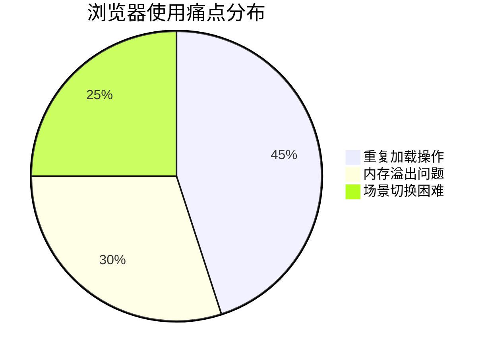

>[!question] 引文
>在日常工作中，许多专业人士都面临着浏览器标签页管理的痛点：每天需要反复打开相同的十几个网页，手动操作既费时又容易遗漏；当电脑因内存问题必须重启时，所有工作页面都需要重新加载，严重影响工作效率；不同项目的网页混杂在一起，难以快速切换工作场景。微软Edge浏览器的「工作区」功能，正是为解决这些问题而设计的专业级解决方案
## 一、核心痛点分析

> [!note] 现状调研
> 根据用户行为分析，我们识别出三大核心痛点：
> 1. **重复劳动**：日均重复加载12-18个高频网页
> 2. **状态丢失**：系统重启导致工作流中断
> 3. **场景混乱**：多项目资源混杂管理

## 二、技术解决方案

> [!abstract] 工作区架构
> Edge工作区采用分层设计：

> [!tip] 配置建议
> |||
> |-|-|
> | **命名规则** | 项目_功能_版本（例：CRM_UI_2.1） |
> | **颜色编码** | 红：紧急；蓝：常规；绿：完成 |
> | **同步策略** | 关键工作区实时同步，辅助工作区按需同步 |

## 三、维护建议

> [!warning] 注意事项
> - 定期清理6个月未使用的工作区
> - 避免单个工作区超过15个标签页
> - 敏感项目工作区启用二次验证

## 四、秒开工作区

>Edge的工作区正常打开要先打开普通的标签页，再点击右上角的图标

![[Pasted image 20250725203320.png]]

>[!important] 重要章节
>我们现在要解决的问题是如何在桌面秒开Edge工作区.
>先在资源管理器中找到这个文件`C:\Users\<你的用户名>\AppData\Local\Microsoft\Edge\User Data\Default\Workspaces`
>然后用文本编辑器打开`WorkspaceCache`,打开之后可以看到里面的工作区的信息及其参数，然后找到你想秒开的工作区的信息，然后记录一下它的`id`,后续会用到

>[!important]
>在桌面复制一个Edge浏览器的快捷方式，把它更名为workspace(不是必须的)，右键快捷方式，找到`属性`，在`目标`里面将原来的
>`"C:\Program Files (x86)\Microsoft\Edge\Application\msedge.exe"`
>后面加上 `--launch-workspace`
>类似这个
>`"C:\Program Files (x86)\Microsoft\Edge\Application\msedge.exe" --launch-workspace=你的id`
>最后将刚才记录的id替换掉，然后就大功告成了

>[!note]
>之后如果你的桌面装了NeXus,可以在图标栏里插入新的Dock项目，
>
>![[Pasted image 20250725204656.png]]
>
>在查找项目里找到刚才新建的快捷方式，然后就完成了
>当然把你也可以添加快捷键，这样就可以在键盘上一键开启工作区了
>另外你可去阿里巴巴的矢量图库下几个图片，换上新图标玩玩

